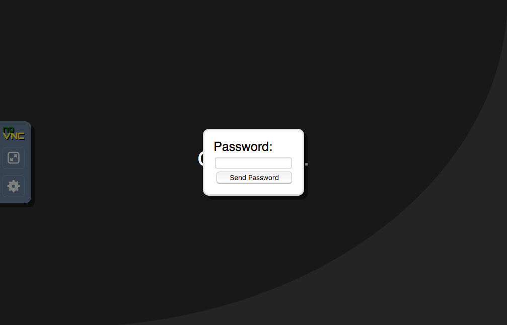
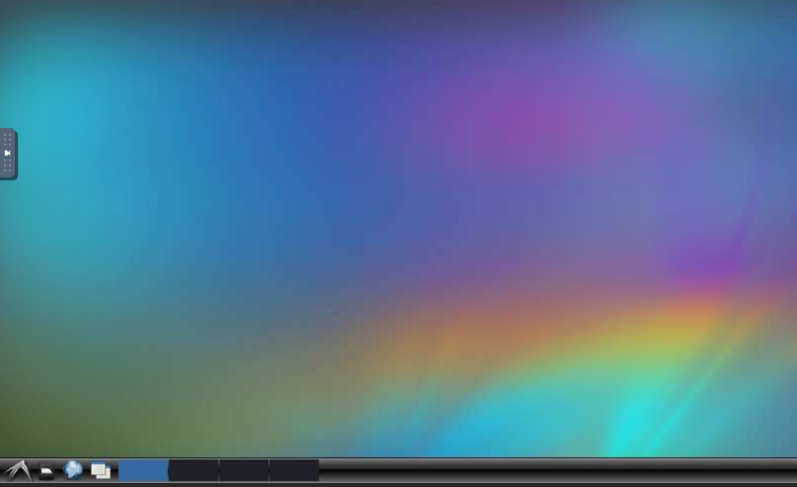
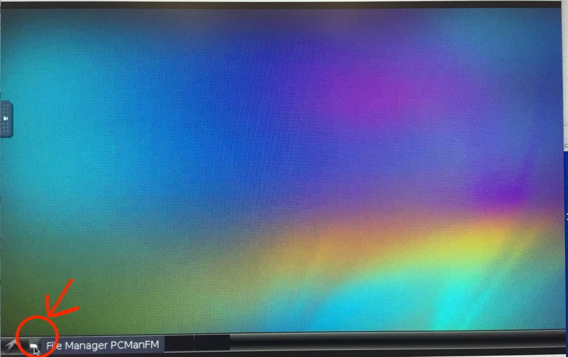
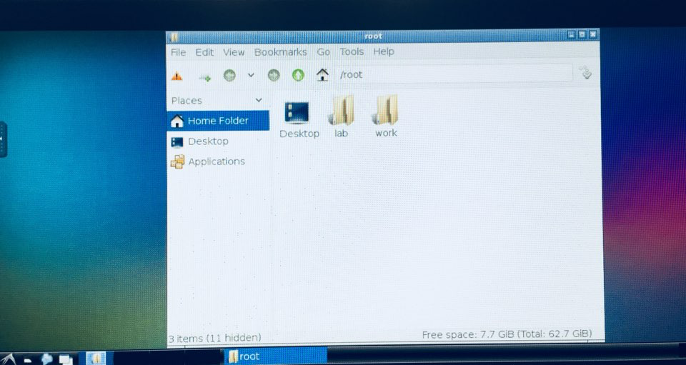
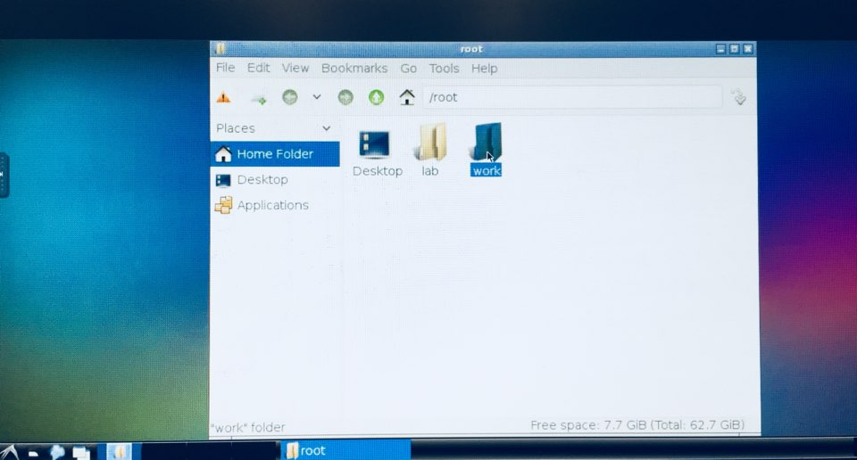
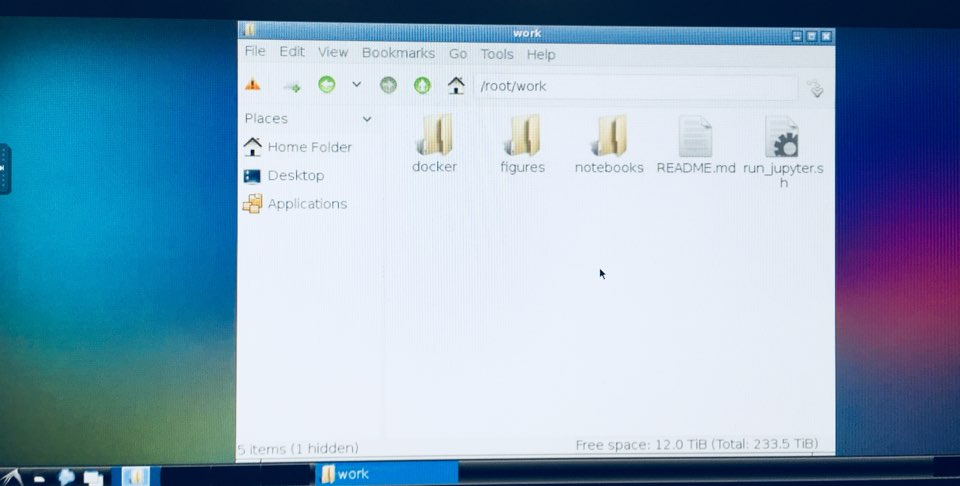
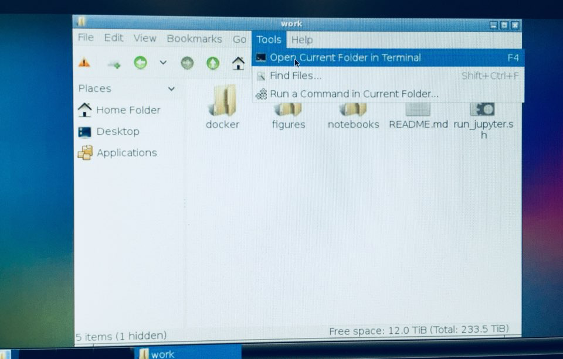
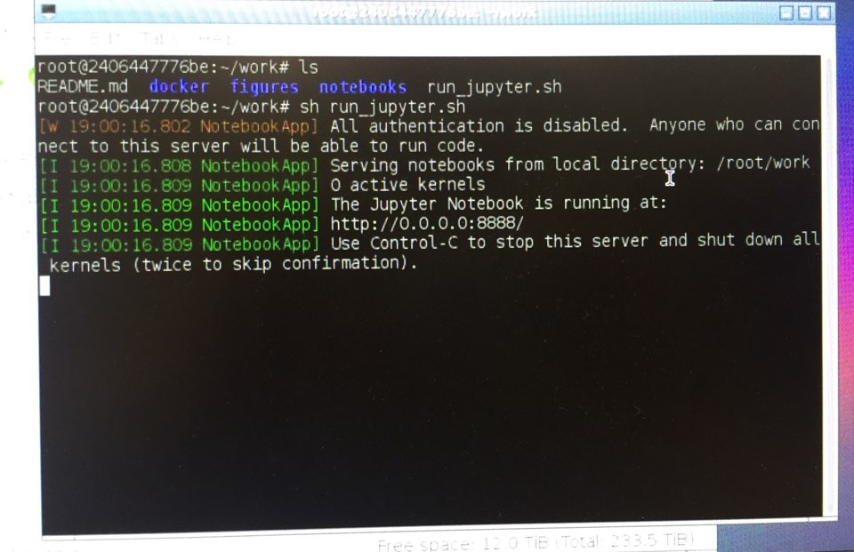
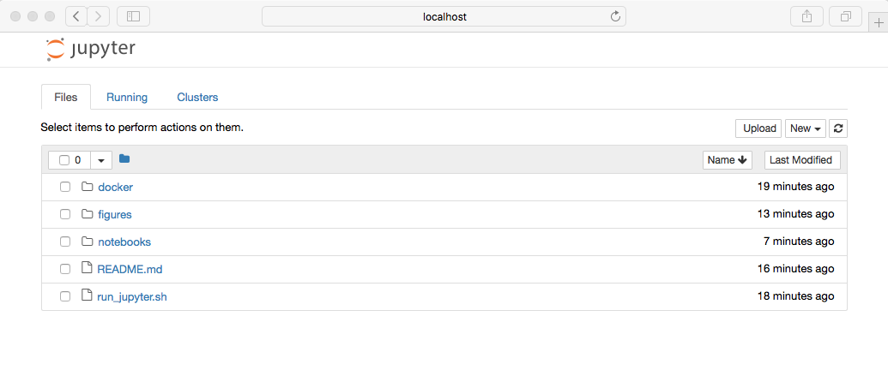

# DeepConnection

터미널에서 현재 저장소 코드를 다운 받은 후, deep_connection/docker 폴더로 이동. 그리고 아래의 명령 실행.
```
docker$ docker-compose up
```
웹 브라우저를 켜서 webVNC 접속 (비번은 1111)
```
http://localhost
```










